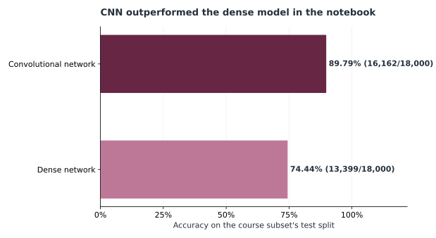
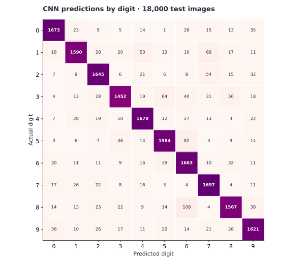

# Historical notebook results

The owner's completed MIT Applied AI program notebook (SHA-256 `73f833ebcbbe6f5b88e2c55ad5b6b6318af31fc164af61926d4ae89de603cec8`) used a course-provided grayscale HDF5 subset: 42,000 training images and 18,000 test images, each 32 × 32 pixels. It also loaded an `X_val` array of 60,000 images, but the shown training code used `validation_split=0.2` on `X_train`; `X_val` did not feed the displayed results.

The counts below were recalculated from the **printed 10 × 10 test confusion matrices** in that notebook. They are historical observations, not the output of a new run of this repository. The source notebook and dataset are excluded because the notebook includes course assignment text and rights to redistribute the processed dataset have not been established.

| Model | Correct / test images | Accuracy |
| --- | ---: | ---: |
| Deeper dense neural network (ANN) | 13,399 / 18,000 | 74.44% |
| Regularized convolutional network | 16,162 / 18,000 | **89.79%** |

Accuracy is computed as the sum of the confusion matrix's diagonal divided by the 18,000 test images.

Rows represent actual digits and columns predictions. Cell colors are scaled within each actual digit, while annotations show counts. Digit **3** had the lowest recall, 1,452/1,719 = **84.47%**. Notable confusions were 8 → 6 (108 images) and 5 → 6 (82 images). The matrix is the numerical source for these observations.

**Interpretation limits:** A stronger result on this particular test split supports the CNN comparison in this experiment, but selecting a final model after inspecting test outcomes can bias any claimed prospective performance. A new run may differ because of the explicit stratified validation split in the public runner, library versions, hardware, and stochastic training. The official Stanford RGB MAT files are a separate dataset path and use a new grayscale conversion; their metrics cannot be treated as a reproduction of the course HDF5 run.

The aggregate matrices used for the figures are in [`historical_metrics.json`](historical_metrics.json). Rebuild the SVGs with `python scripts/build_historical_charts.py` after installing the base package.
